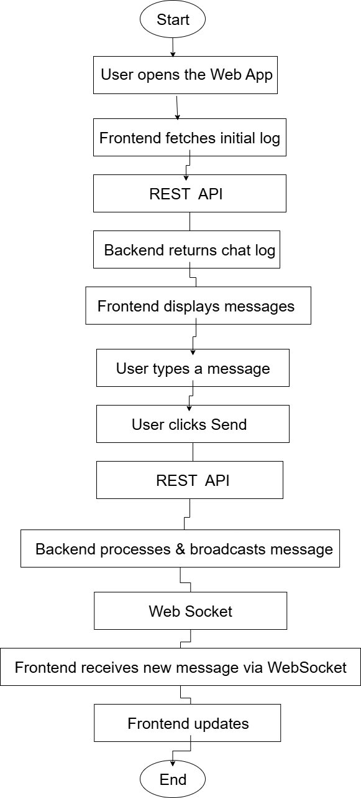
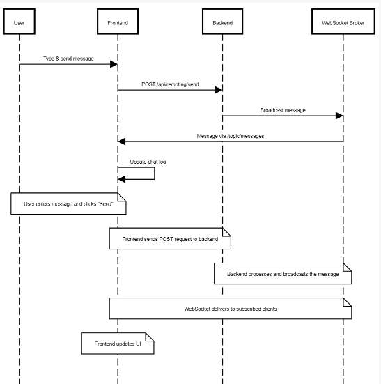
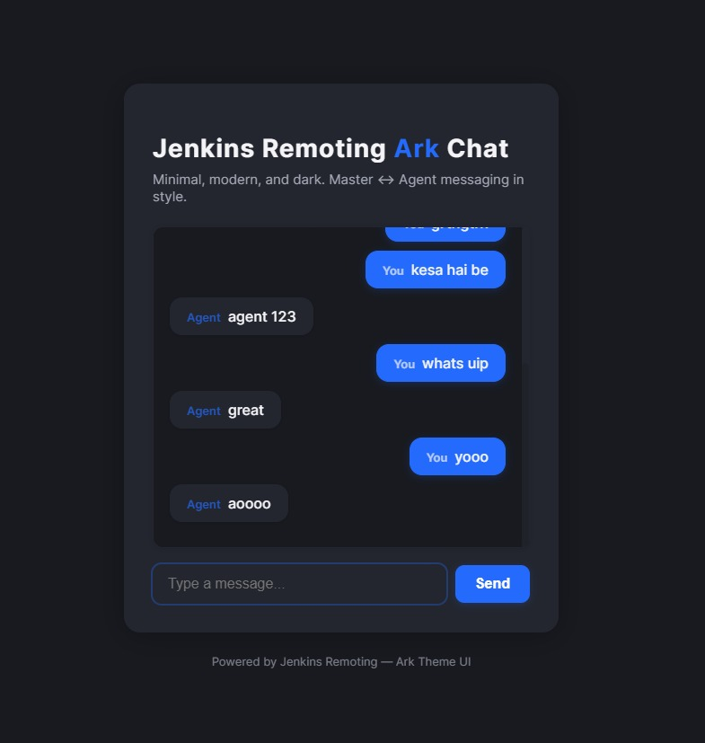

# Jenkins Remoting Ark Chat

[](https://github.com/your-repo)
[](LICENSE)
<!-- Add more badges as needed -->

---

## 🚀 Introduction / Overview

**Jenkins Remoting Ark Chat** is a modern, real-time chat application designed for seamless communication between Jenkins Master and Agent nodes. Built with a focus on minimalism, dark mode aesthetics, and robust real-time messaging, this project demonstrates a full-stack approach to interactive DevOps tooling.

---

## 🛠️ Tech Stack

- **Frontend:** React, SockJS, STOMP.js
- **Backend:** Java, Spring Boot, WebSocket (STOMP), REST API
- **DevOps:** Jenkins (CI/CD), Maven, npm
- **Build Tools:** Maven (backend), npm (frontend)
- **Other:** Custom Ark Theme UI, Draw.io (for diagrams)

---

## ✨ Features

- Real-time chat between Jenkins Master and Agent
- Modern, dark-themed Ark UI
- REST API for message history and sending
- WebSocket (STOMP) for instant message delivery
- Responsive design for desktop and mobile
- Easy setup and deployment

---

## ⚡ Installation Instructions

1. **Clone the repository:**
   ```sh
   git clone https://github.com/your-username/jenkins-remoting.git
   cd jenkins-remoting
   ```
2. **Backend Setup:**
   ```sh
   mvn package
   # or use your IDE to build the Spring Boot project
   ```
3. **Frontend Setup:**
   ```sh
   cd frontend
   npm install
   ```

---

## ▶️ Usage

1. **Start the backend (Spring Boot):**
   ```sh
   mvn spring-boot:run
   # or run the generated JAR
   java -jar target/jenkins-remoting-demo-1.0-SNAPSHOT.jar
   ```
2. **Start the frontend (React):**
   ```sh
   cd frontend
   npm start
   ```
3. **Access the app:**
   - Open [http://localhost:3000](http://localhost:3000) in your browser.

---

## 🏗️ Flowchart

<!-- Replace the link below with your actual Draw.io or image diagram -->


---

## Sequence Diagram

<!-- Replace the link below with your actual Draw.io or image diagram -->


---

## 📚 API Documentation

- **REST Endpoints:**
  - `GET /api/remoting/log` – Fetch chat log
  - `POST /api/remoting/send` – Send a message
- **WebSocket:**
  - Endpoint: `/ws`
  - Topic: `/topic/messages`

<!-- Add a link to full API docs if available -->

---

## 🖼️ Frontend UI Snapshot

<!-- Add screenshots of the UI here -->


---

## 🤝 Contributing

Contributions are welcome! Please open issues or submit pull requests for improvements, bug fixes, or new features.

1. Fork the repository
2. Create a new branch (`git checkout -b feature/your-feature`)
3. Commit your changes
4. Push to your fork and open a Pull Request

---


## 🔗 Useful Links

- [Live Project](https://your-live-project-url.com)
- [Jenkins Documentation](https://www.jenkins.io/doc/)
- [Spring Boot Docs](https://spring.io/projects/spring-boot)
- [React Documentation](https://reactjs.org/)
- [Draw.io](https://app.diagrams.net/)

---

